# Vulkan Ray Tracer

A real-time physically-based ray tracer built with Vulkan's ray tracing extensions. This project implements advanced rendering techniques including PBR materials, reflections, refractions, and soft shadows.

## Shadows
This renderer uses shadow rays to determine light visibility at intersection points, resulting in realistic soft shadows. Area lights are sampled to create smooth penumbra effects.

| Hard Shadows (Point Light) | Soft Shadows (Area Light) |
|----------------------------|---------------------------|
| 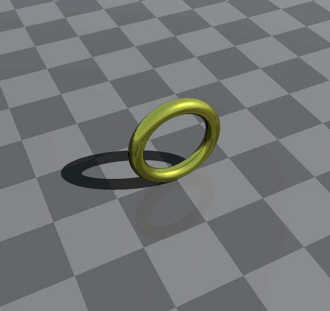 | 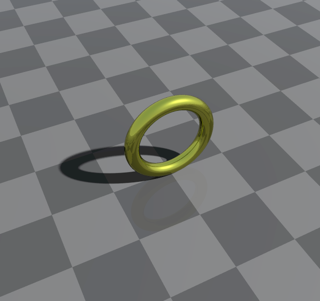 |

## Reflection
This renderer employs recursive ray tracing to achieve realistic reflections on surfaces. It accurately simulates how light interacts with reflective materials, including the effects of surface roughness.

    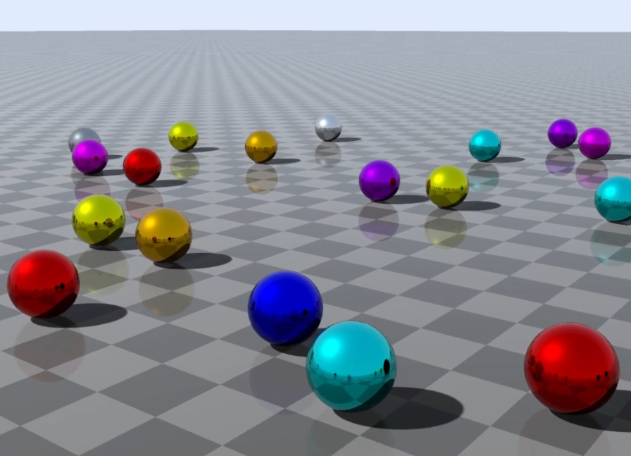

| Reflection |
|------------|
| 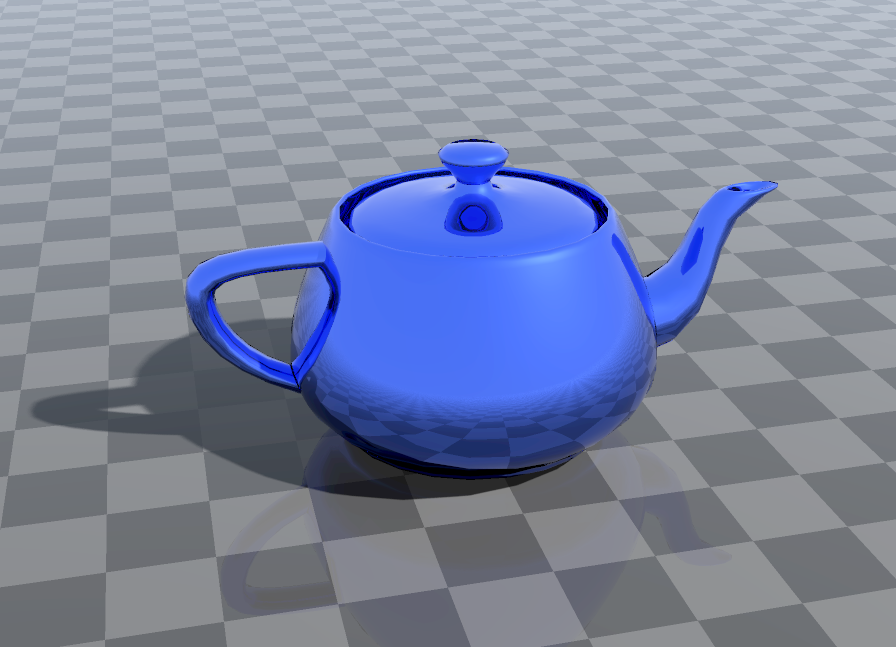 |

## Transparency & Refraction
Using recursive ray tracing, this renderer simulates realistic light behavior through transparent materials. Shadowing takes into account the transparency of objects.

    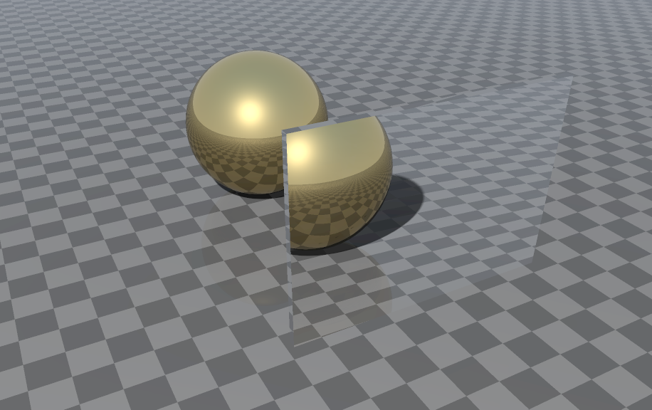

### Key Features
- **Snell's Law**: Accurate light bending through transparent materials
- **Fresnel Reflectance**: Angle-dependent reflection and transmission
- **Beer-Lambert Absorption**: Realistic color attenuation in volumetric materials

| Tranparency | Absorption (Beer-Lambert) |
|-------------|---------------------------|
| 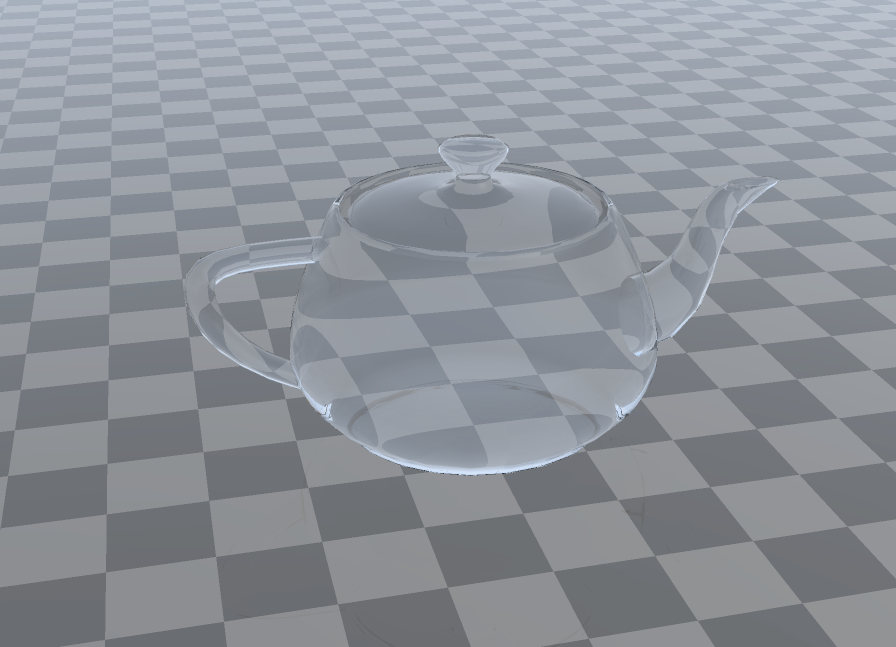 | 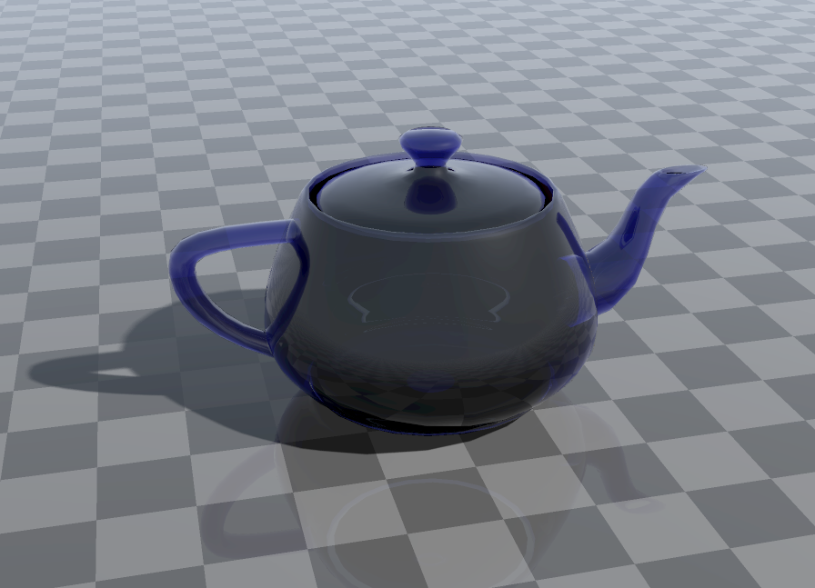 |

## Physically Based Rendering (PBR)
- **Cook-Torrance BRDF**: Industry-standard microfacet-based lighting model
- **Fresnel Effect**: Realistic reflection behavior at grazing angles
- **GGX Normal Distribution**: Advanced specular highlights
- **Smith Geometry Function**: Accurate light occlusion from surface roughness
- **Metallic/Roughness workflow**: Intuitive material authoring

| Diffuse | Metallic | Glass | Marble | Semi-Transparent |
|---------|----------|-------|--------|------------------|
| 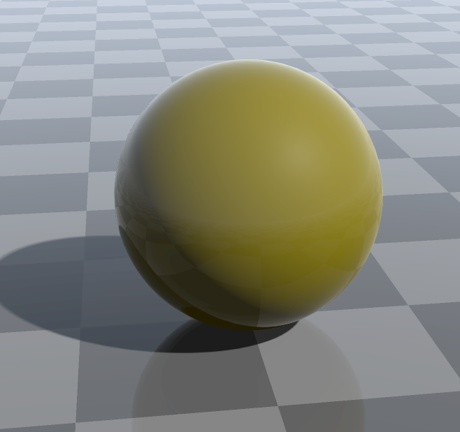 | 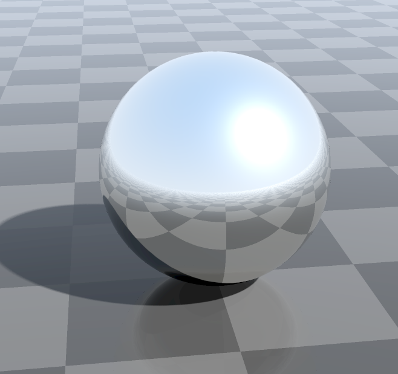 | 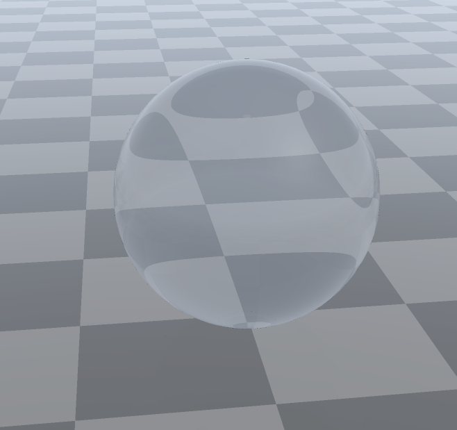 | 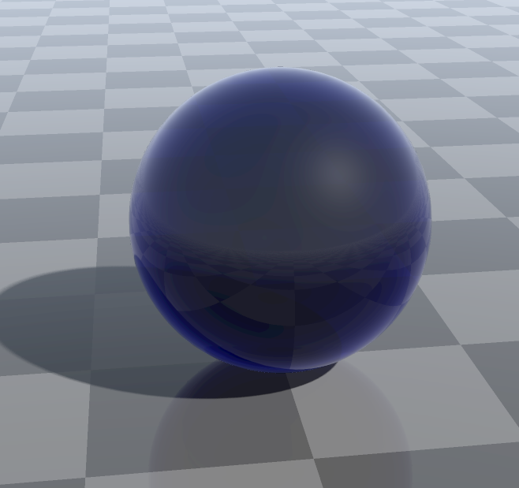 | 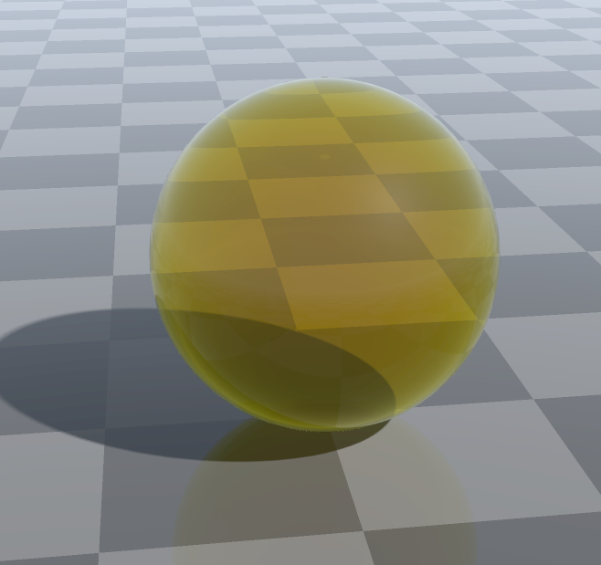

